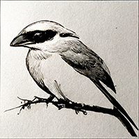

<h1 align="center">
  Shrike
</h1>

  

**WARNING: Do not allow the port being used by the web server to be accessed from outside of localhost, and preferabbly don't run the server when you're not using the extension. This project is experimental and intended for software developers.**

A browser extension to run a shell command with dynamic arguments and the current tab URL.
The extension requires a Go webserver to execute a shell command with the provided arguments and URL. The server accepts a POST request containing json from the extension in the form `{"Command":"echo", "Arguments":["https://example.com"]}`

https://user-images.githubusercontent.com/1828509/184451372-e95ecff9-05f0-4c09-8162-7659c2cd4d93.mp4

## Dependencies

- Install GO (To Build the Server). https://go.dev/
- Install Node(To Build the Browser Extension). https://nodejs.org/en/download/

## Building the Server

- Clone the repository from GitHub.
- Change directory into the project directory. Then into the server directory `cd shrike/server`.
- Build the server by running `go build .`

## Setup

- Run the server with `./server` or `./server.exe` on Windows.
- Install the extension in to your browser of choice by following the instructions in the extension directory readme. The extension is based off of the React [TypeScript Web Extension Starter](https://github.com/aeksco/react-typescript-web-extension-starter)

## Usage

- Configure the command you want to run by editing the command and arguments in the extension pop up.
- Hit the Run button to execute the command. You can see the StdOut and StdErr in the terminal where the web server is running.
